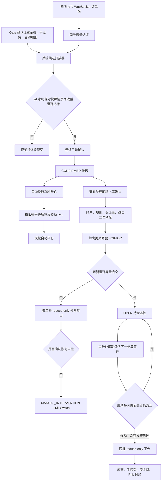

# CrossQuant 跨所资金费套利使用教程

> 适用范围：Gate CrossEx 账户下，在 Gate、Binance、OKX、Bybit 永续合约之间做资金费套利。
> 这不是收益承诺。资金费率会变化，基差可能扩大，两腿可能无法同时成交。第一次实盘必须从 Canary 小额人工确认开始。

## 1. 先用一句话理解这个策略

同一个币种，在资金费率较低的一家交易所做多，在资金费率较高的一家交易所做空，两边使用相同基础币数量，使价格涨跌尽量互相抵消，主要赚两边资金费率的现金流差。

例如 SOL：

- Gate 资金费率为 `-0.0035% / 8h`：做多方理论上收取资金费；
- Bybit 资金费率为 `+0.00974% / 8h`：做空方理论上收取资金费；
- 因此选择“Gate 多 + Bybit 空”。

但这只说明资金费方向有利。是否赚钱还要扣除开仓、平仓共四笔手续费，计算两边真实盘口、滑点、进出场基差，并考虑资金费率在下一次结算前反转的可能。

把这个示例直接换算成金额，会更容易看出问题。假设两腿名义金额都是 10,000 USDT：

```text
每 8 小时资金费优势 = 0.00974% - (-0.0035%) = 0.01324%
每 8 小时快照情景毛收益 = 10,000 × 0.01324% = 1.324 USDT
每天快照情景毛收益 = 1.324 × 3 = 3.972 USDT

若每笔 taker 手续费为 0.05%：
四笔手续费 = 10,000 × 0.05% × 4 = 20 USDT
仅覆盖手续费需要 = 20 ÷ 3.972 ≈ 5.0 天
```

这还没有扣滑点，也没有考虑未来退出基差恶化。结论不是“SOL 可以赚”，而是“资金费方向正确，但短期很可能亏钱”。只有实际账户手续费更低、优势持续足够久，并且保守净收益仍大于零时，才可能成为候选。

## 2. 钱从哪里赚，风险从哪里来

### 2.1 收益组成

一组完整套利包含两条腿：

| 腿 | 操作 | 目的 |
| --- | --- | --- |
| 多腿 | 资金费率较低的交易所买入永续合约 | 获得较低的资金费成本，负费率时可能收钱 |
| 空腿 | 资金费率较高的交易所卖出永续合约 | 正费率时由多方支付给空方 |

一个持有窗口内的近似净收益为：

```text
净收益
= 空腿实际资金费收入
- 多腿实际资金费支出
+ 多腿和空腿的完整价格损益
- 多腿开仓手续费
- 空腿开仓手续费
- 多腿平仓手续费
- 空腿平仓手续费
- 实际滑点和其他费用
```

界面里的 APR 只是把某个收益快照折算成年化：

```text
年化 ≈ 情景期净收益率 × 8760 ÷ 情景期小时数
```

年化只是比较单位，不代表这个费率能维持一年。

对于线性合约且两腿基础币数量同为 `q`，完整的价格损益应写成：

```text
价格损益
= q × [(P_long,exit,bid - P_long,entry,ask)
     + (P_short,entry,bid - P_short,exit,ask)]
```

这一个公式已经同时包含开仓买卖价差、平仓买卖价差、两所基差变化以及使用多档成交均价时的滑点，不应再额外重复加一个“基差收益”。后端当前用实时盘口模拟“现在开仓、现在立即平仓”，因此只能估算此刻的往返交易摩擦，不能预测未来真正退出时的基差。

### 2.2 四种资金费数据不要混为一谈

| 数据 | 含义 | 是否已锁定 |
| --- | --- | --- |
| 上一次实际结算费率 | 已经发生的历史现金流 | 是，但只能说明过去 |
| 当前接口 `funding_rate` | 交易所当前返回的费率值 | 否 |
| 下一次结算前动态预测值 | 会随溢价和市场状态变化 | 否 |
| 最终实际结算费率 | 结算时真正用于扣款/入账的值 | 结算发生后才确定 |

Gate CrossEx 接口返回字段名 `funding_rate`、`funding_time`、`funding_interval`；官方特别说明 Deribit 的值是实时计算的 8 小时当前费率。接口没有承诺当前值会在未来 24 小时保持不变。因此本项目计算的是：

```text
“当前 funding_rate 在情景期内保持不变”时的快照情景
```

它不是未来 24 小时预测，更不是锁定收益。

### 2.3 价格中性不是无风险

两边等量以后，大盘涨跌造成的方向风险会明显降低，但下面的风险仍然存在：

- 两家交易所价格不同，基差可能在持仓期间扩大；
- 一条腿成交、另一条腿失败，会短暂产生裸露方向仓位；
- 资金费率可能在入场后反转；
- 手续费可能大于一两次资金费收入；
- 盘口深度不足会造成滑点；
- API、网络或交易所可能返回不确定订单状态；
- 保证金不足、ADL 或交易所规则变化可能迫使提前退出；
- 合约数量步长可能让“两腿 5 USDT”无法精确实现。

## 3. 系统实际如何运行



### 3.1 自动候选扫描

后端每 60 秒对 60～100 个币做轻量发现；BTC、ETH、SOL 仍是严格实盘白名单，只有动态热池中的 8～12 个币会读取完整订单簿：

1. 从 Gate CrossEx 已认证接口读取各所当前资金费率和下一次结算时间；
2. 按每个交易所真实结算间隔，计算未来 24 小时情景窗口包含几次结算事件；
3. 找出资金费总额较低的一侧做多、较高的一侧做空；
4. 读取每家交易所的 taker 手续费；
5. 使用多档订单簿计算目标数量的开仓和假设立即平仓价格；
6. 用当前盘口计算立即往返价格损益，并扣除四笔手续费；
7. 正向资金费只保留配置比例，并额外扣除滑点压力和未来退出基差逆向缓冲；
8. 只接受 `LIVE_SYNCHRONIZED` 行情；
9. 同一组合连续三轮通过，才成为 `CONFIRMED` 候选。

浏览器不能手工提交费率或伪造候选。

### 3.2 自动模拟盘

模拟盘与实盘订单表完全隔离。服务器显式开启 `GCT_FUNDING_PAPER_ENABLED=1` 后，每轮候选扫描会同时驱动模拟盘：

1. 只接受当前仍在连续确认窗口内的 `CONFIRMED` 候选；
2. 再次要求两边订单簿为 `LIVE_SYNCHRONIZED`，并按目标数量逐档计算模拟成交均价；
3. 开仓时立即扣除两腿模拟 taker 手续费，不使用 mark price；
4. 每分钟用当前可执行平仓盘口计算价差损益、退出手续费和“此刻平仓”模拟 PnL；
5. 根据两家交易所各自的结算时间保存模拟结算事件；到点后使用结算前最后一次保存的费率快照做模拟到账；
6. 普通持有价值不足连续三轮后模拟平仓，费率反转和 24 小时硬上限直接退出；
7. 行情连续三轮降级时先记录不可成交状态，恢复同步后的第一轮按真实恢复盘口模拟退出；
8. 候选 ID、交易对和结算事件都有唯一约束，服务重启不会重复开仓或重复记资金费。

模拟资金费不是 Gate 账户真实流水，只用于验证策略。如果实际结算费率与最后预测值不同，模拟结果也会出现偏差；实盘阶段仍以 Gate `FUNDING_FEE` 账户流水为准。

### 3.3 独立探索模拟

`GCT_FUNDING_RESEARCH_ENABLED=1` 开启的是单独的 `RESEARCH` 账本，不会改变 `CONFIRMED` 门槛，也不能调用订单运行时：

1. 严格实盘扫描仍只覆盖 `GCT_FUNDING_SCAN_ASSETS`；扩展发现池可配置 60～100 个币，只读取资金费、Ticker、交易规则和持仓量；
2. 每轮先对 Gate、Binance、OKX、Bybit、Kraken、Hyperliquid、Deribit 做资金费粗排；只有优势持续、持仓量、Ticker 新鲜度、合约状态、结算计划和执行器支持都合格的 8～12 个币进入动态 WebSocket 盘口热池；
3. 同时标记“达到实盘标准”“只达到研究标准”和“完全拒绝”，保存主要拒绝原因；
4. 研究资格仍要求 `LIVE_SYNCHRONIZED`、合约可交易、共同数量合法、10bp 内开平四向 USD 深度足够且滑点不超限；
5. 即使扣费后净收益为负，也从本轮研究资格组合中选择净收益最高的一组；
6. 同一时点同时建立“一次结算验证组”和“滚动持仓组”，每组最多三个不同 `OPEN` 组合；目标单腿 5 USD，实际金额按共同最小数量向上取整，但任一腿超过 10 USD 就拒绝；
7. 一次结算组只承认开仓之后、两条腿都真实跨过的结算时点；`rolling_v6` 滚动组至少观察 24 小时，期间普通持有价值不足只记录不退出，资金费方向持续反转仍可提前退出；24 小时后普通退出需连续 180 次有效扫描、方向反转需连续 60 次有效扫描，恢复后对应计数清零；
8. USD、USDC、USDT 价格先按实时中间价换算成 USD；汇率过期或脱锚时拒绝候选，跨报价组合还会额外扣稳定币风险缓冲；
9. 开仓、平仓、四笔手续费、价差损益、资金费、基差、滑点、优势持续时间、方向翻转次数和最终 PnL 全部单独保存；模拟到账明确标记为 `PREDICTED_SNAPSHOT`，不再冒充交易所真实流水；
10. 后端并行保存四种研究口径：Taker/Taker 一次结算、Taker/Taker 滚动持仓、按成交概率折算的 Maker/Taker 反事实，以及 Gate/Binance/OKX 同所现货/永续现金套利；后三类不会进入实盘下单器；
11. 命中率来自 `funding_rate_history` 中两条腿都有真实结算数据的完整 UTC 日。样本不足 7 日时继续使用人工保守持续率，样本足够后只能把持续率调低，不能因为短期历史好看而自动放宽实盘门槛。
12. 滚动组平仓后至少冷却 12 小时，并等待两条腿都跨过各自下一次结算点；`rolling_v1`～`rolling_v5` 只保留为审计历史，其中 `rolling_v5` 存在开仓前结算归属缺陷，不与 `rolling_v6` 当前统计混算。

广域发现快照每五分钟落库。除资金费、Ticker、规则和持仓量原值外，还保存：最优多空方向、8 小时等效费率差、下一结算时间与周期、优势开始时间、连续确认次数、24 小时方向翻转次数、执行器支持状态、合约 live/下架风险判断、Ticker 年龄、热池资格/拒绝原因和当时热池成员。进入热池以后，系统才继续保存四向多档成交均价、深度、滑点、合法数量、实际名义金额、基差、手续费、压力缓冲、保守净收益和模拟持仓账本。

研究结果的用途是回答“降低条件后真实会亏在哪里”，不是证明策略可实盘。`RESEARCH` 记录不会写入实盘候选表，也不会被实盘接口消费。

### 3.4 入场前二次检查

点击实盘入场后，后端不会直接相信一分钟前的候选，而会重新检查：

- 候选仍是 `CONFIRMED`，没有过期或被使用；
- 两边行情仍为 `LIVE_SYNCHRONIZED`；
- 行情年龄、交易所时间差和本机接收时间差合格；
- 多档盘口深度足够；
- 预计入场滑点和两边基差没有超限；
- 合约仍为 `live`；
- 数量满足 `min_size`、`lot_size` 和最大数量；
- 名义金额满足 `min_notional`；
- 限价保护价格满足 `tick_size`；
- 预计新增总敞口没有超过账户限制；
- 账户快照新鲜、私有流正常；
- 可用保证金比例、日亏损和 ADL 合格；
- 全局 Kill Switch 没有触发；
- 资金费实盘总开关和额度均已开启。

任一项不满足都会拒绝，不会“凑合下单”。

### 3.5 开仓后的滚动持仓模型

入场模型和持仓模型是两套账：

- 入场时用 24 小时“当前费率不变”情景，扣除四笔手续费、当前往返盘口成本、滑点压力和基差缓冲，判断是否值得承担一次完整开平仓成本；
- 开仓后每分钟只判断未来一至两个真实结算事件的边际价值。已经支付的开仓手续费是沉没成本，不会每分钟重复扣除；
- `继续持有价值 = 未来结算保守资金费 - 新增滑点压力 - 新增基差风险缓冲`；
- 研究模拟 `rolling_v6` 中，任何不晚于开仓时刻的结算事件都会被滚动到下一合法周期或取消；系统直接查询并评估全部 `OPEN` 仓位，不再从最近十条历史记录中筛选；
- 滚动组第一次双腿结算前不累计普通退出计数；开仓后 24 小时内，普通继续持有价值不足只记录不退出；24 小时后需要连续 180 次有效扫描确认，资金费现金流方向反转需要连续 60 次有效扫描确认；行情降级不增加计数，优势恢复则清零；
- 以上延迟退出只用于研究模拟。真实订单状态机目前仍使用原来的安全确认参数，没有随本次实验自动放宽；
- 结算前后 30 秒进入保护期，暂停普通收益退出，硬风控仍然有效；
- 第一次 Canary 默认 8 小时软复核、24 小时硬上限。软复核只提醒，优势仍为正时不会因为到点机械平仓；
- 实际资金费在结算后自动用账户流水 ID 幂等对账。五分钟仍未到账，或金额超过绝对/相对误差限制，会告警并退出。

因此“继续收到一点资金费”不是无限持仓理由。仓位漂移、监控陈旧、私有流掉线、基差或退出滑点超限、账户风险和硬性时间上限都优先于收益判断。

## 4. 前端每个页面怎么用

公网地址：`https://crossquant.shadowdawn.xyz`

### 4.1 登录

1. 打开公网地址；
2. 使用 Google 登录；
3. 只有访问白名单用户可以查看；
4. 目前只有 `chenxiyin.tom@gmail.com` 是交易员，其他白名单账号只能查看；
5. 未登录访问 API 会返回 401，页面会进入登录流程。

### 4.2 底部状态栏：先看系统是否健康

每次操作前先看页面底部：

| 显示 | 正常状态 | 不正常时怎么办 |
| --- | --- | --- |
| Backend stream | connected | 不要开仓，刷新一次；仍断线就检查服务 |
| Market data | healthy | 不要开仓，等待 WebSocket 恢复 |
| Account | Account live | 不要开仓，检查 Gate 凭据和私有流 |
| 环境 | LIVE | 说明连接的是实盘环境，不代表已经允许下单 |

`LIVE` 环境和 `Live trading` 交易模式不是一回事。前者表示数据/接口属于实盘，后者才表示当前后端会接受下单。

### 4.3 顶栏交易模式

顶栏会显示：

- `Read-only`：只能看行情、账户和历史，不能下单；
- `Live trading`：普通交易入口已解锁，但资金费策略仍受独立总开关控制。

切换流程：

1. 点击顶栏 `Read-only`；
2. 阅读风险免责声明；
3. 勾选“我已阅读并理解风险”；
4. Canary 前才选择 `Enable live trading`；
5. 如果重启后端，交易模式会重新锁定，需要再次人工确认。

即使这里切到 `Live trading`，只要服务器的 `GCT_FUNDING_LIVE_ENABLED=0` 或资金费额度为 0，资金费入场按钮仍不会执行真实订单。

### 4.4 Funding Rates 页面：发现线索

这是日常最常看的页面。

页面最上方的“探索模拟模式”显示：

- 60～100 币广域发现排名、8 小时等效费率差、持仓量、持续时间、翻转次数，以及当前 8～12 币动态盘口热池；
- 最近 24 小时扫描组合、实盘合格、研究合格和完全拒绝数量；
- 最新一轮每个组合的毛快照 APR、可执行保守净收益、四笔手续费、盘口往返损益、稳定币风险与压力缓冲；
- 实盘拒绝原因、盈亏平衡持有小时数、合法数量与实际单腿名义金额；
- 当前和历史两组 `RESEARCH` 持仓、优势持续时间、方向翻转、模拟结算命中率与评估时间线。

其后的“资金费模拟盘”显示：

- 当前模拟持仓数、已平仓数、模拟胜率；
- 已扣模拟手续费的累计 PnL；
- 模拟资金费、价格损益和开平仓手续费；
- 真实资金费快照与同步盘口样本累计数量；
- 每个模拟组合的开仓均价、当前费率、基差、下一结算时间和继续持有价值；
- 展开后的模拟结算明细和每分钟滚动评估时间线。

再下方的“资金费套利状态机”只显示真实订单状态机，不能与两套模拟账本混淆。模拟持仓不会出现在“资产”页面，因为它不属于 Gate 真实账户。

#### 交易所筛选

选择需要比较的交易所。资金费套利至少需要两家。当前自动执行模块使用：

- Gate.io
- Binance
- OKX
- Bybit

Kraken、Hyperliquid、Deribit 已进入后端资金费扫描和同步订单簿，但目前只允许研究模拟；前端会标记“暂不支持实盘”。当前四所自动执行状态机仍只允许 Gate.io、Binance、OKX、Bybit。

#### Min average OI

这是最低平均持仓量筛选。建议：

- Canary：优先选择 BTC、ETH、SOL 等高流动性币；
- 先设置较高 OI，避免小币种的虚高费率和薄盘口；
- OI 只是流动性参考，不能替代订单簿深度检查。

#### 五种费率视图

| 视图 | 含义 | 用法 |
| --- | --- | --- |
| Per interval | 当前每个结算周期费率 | 看下一次结算方向 |
| APR | 毛快照 APR：当前费率快照折算年化 | 只用于排序，不是预期利润；同时查看后端“可执行保守净收益” |
| 24h | 历史 24 小时实际累计 | 看近期是否持续 |
| 7d | 历史 7 天实际累计 | 判断费率稳定性 |
| 30d | 历史 30 天实际累计 | 判断长期分布和极端值 |

#### Average rate

所选交易所的平均费率，只表示市场整体偏多或偏空，不直接决定套利方向。

#### Max arb / Best spread

显示矩阵中最高费率和最低费率的差，并给出类似：

```text
Long GATE · Short BYBIT
```

它是“值得进一步计算”的线索，不是下单信号，因为它没有完整展示四笔手续费、盘口深度、可执行基差和候选连续性。

#### 点击币种行

进入历史资金费详情，重点看：

- 费率优势是否只出现一次；
- 过去 24 小时和 7 天是否经常反转；
- 两家交易所结算时间是否一致；
- 极端费率出现后能维持几个周期；
- 历史累计是否足以覆盖一次完整开平仓成本。

### 4.5 资金费套利状态机面板

Funding Rates 页面顶部有“资金费套利状态机”。

#### 后端安全锁定

表示 `GCT_FUNDING_LIVE_ENABLED=0`。这是当前正常观察状态，按钮不可用。

#### 后端已启用

表示资金费策略独立开关已经打开。仍需同时满足：

- 当前登录账号是交易员；
- 顶栏处于 `Live trading`；
- 至少一个候选为 `CONFIRMED`；
- 所有后端风控通过。

#### 确认候选并实盘入场

只有后端存在 `CONFIRMED` 候选时才可用。点击后：

1. 前端只提交候选 ID 和人工确认；
2. 后端重新做全部预检；
3. 冻结持久化交易意图；
4. 并发提交两腿；
5. 返回交易状态。

面板会显示后端确认候选的当前费率快照、保守情景年化和连续确认次数。这里的年化仍是情景折算，不是锁定收益；不能只依据下方矩阵的 APR。

#### 最近执行

这里显示资金费状态机的最近记录：

| 状态 | 含义 | 操作 |
| --- | --- | --- |
| `SUBMITTING` | 两腿正在提交 | 不要重复点击 |
| `SETTLING` | 等待成交/撤单确认 | 观察几秒，关注告警 |
| `OPEN` | 两腿已等量确认 | 去 Portfolio 核对真实仓位 |
| `REPAIRING` | 正在清理单腿敞口 | 不要新开仓，立即关注告警 |
| `REJECTED` | 未形成有效组合 | 检查失败原因，无仓位后再处理 |
| `CLOSED` | 已平仓并对账 | 核对资金流水和最终 PnL |
| `MANUAL_INTERVENTION` | 系统无法证明安全 | 禁止新单，人工核对 Gate 后台 |

`OPEN` 状态旁边会出现“平仓”按钮，使用两腿 reduce-only 平仓。

每个执行记录还会显示：

| 字段 | 含义 |
| --- | --- |
| 继续持有价值 | 未来真实结算事件的保守资金费，扣除新增滑点和基差风险；不包含沉没的开仓手续费 |
| 立即平仓 PnL | 按当前多档退出盘口估算的价格损益，加已到账资金费，扣已发生手续费和预计退出手续费 |
| 实际资金费 | Gate 账户流水已经匹配并累计的金额，不是预测 |
| 当前基差 | 两边当前可执行退出均价的差，单位 bps |
| 下一结算 | 两条腿中最近的实际结算时间 |
| 不盈利确认 | 普通边际价值不足的连续次数，默认达到 3 次退出 |

点击“查看评估”可以展开两张时间线：一张是未来结算事件的 `PENDING / MATCHED / ANOMALOUS / MISSING` 对账状态；另一张是每分钟 `HOLD / REVIEW_REQUIRED / SETTLEMENT_GUARD / EXIT_PENDING / EXIT / DEGRADED` 判断及原因。

### 4.6 Portfolio 页面：确认钱和仓位

#### 顶部五个关键数字

| 数据 | 重点 |
| --- | --- |
| Margin balance | 账户保证金权益 |
| Available margin | 可用于新仓的保证金 |
| Unrealized PnL | 当前未实现盈亏；中性策略也可能短时波动 |
| Gross exposure | 两腿绝对名义价值之和，不是净敞口 |
| Margin usage | 越高越危险，Canary 应保持很低 |

#### Positions

开仓后必须看到同一币种两条腿：

- 一条 Long；
- 一条 Short；
- 基础币数量绝对值一致；
- 交易所和候选一致；
- 杠杆符合配置；
- 两腿都不是异常方向。

如果只看到一条腿，或数量不一致：不要手工再开新仓；先看系统是否进入 `REPAIRING`。如果进入 `MANUAL_INTERVENTION`，立即在 Gate CrossEx 后台核对真实订单和仓位。

#### Open orders

正常 FOK 入场完成后，不应长期留下普通挂单。若存在长时间未完成订单，应暂停新单并检查状态。

#### Trade history

核对两腿：

- 成交时间；
- 成交方向；
- 成交数量；
- 成交均价；
- 手续费；
- 客户端订单 ID 和交易所订单 ID。

#### Funding history → Funding fees

结算后在 Portfolio 的 Funding history 区域选择 `Funding fees`，核对：

- 两家交易所是否都产生资金费记录；
- 正负方向是否符合预期；
- 实际净资金费是否接近预估；
- 是否出现漏记、延迟或异常金额。

## 5. 真正应该关注哪些数据

### 5.1 第一优先级：安全数据

任何一项异常都不应该开仓：

- Backend stream 不是 connected；
- Market data 不是 healthy；
- Account 不是 live；
- 候选不是 `CONFIRMED`；
- 盘口不是 `LIVE_SYNCHRONIZED`；
- 账户快照陈旧；
- 私有 WebSocket 断线；
- Kill Switch 已触发；
- 出现 `MANUAL_INTERVENTION`；
- 可用保证金比例低；
- ADL 排名过高或缺失；
- 日亏损已经达到限制。

### 5.2 第二优先级：真实可执行收益

按重要性依次看：

1. 后端保守快照情景净年化，而不是矩阵 APR；
2. 未来持有窗口内的实际结算次数；
3. 四笔 taker 手续费；
4. 当前盘口立即往返价格损益；
5. 未来退出基差逆向缓冲；
6. 目标数量下的多档盘口均价；
7. 费率优势过去 24 小时/7 天的持续性；
8. 预计净收益金额，而不只是百分比。

小额交易尤其容易被最低手续费和数量步长影响。年化很高但 24 小时只赚几分钱的机会，没有足够容错空间。

### 5.3 第三优先级：容量和流动性

- Open interest；
- 买卖盘口深度；
- 买一卖一价差；
- 目标数量相对盘口的比例；
- `min_size`、`min_notional`、`lot_size`；
- 两腿共同可用的最小数量步长。

例如 SOL 当前 Gate 最小数量和步长都是 `0.1 SOL`。SOL 约 76.4 USDT 时，最小每腿约 7.64 USDT，所以无法精确执行 5 USDT/腿。

### 5.4 持仓期间的数据

- 两腿实际数量是否继续一致；
- 净基础币敞口是否接近 0；
- 当前资金费方向是否反转；
- 下一次结算时间；
- 基差是否快速扩大；
- 保证金使用率；
- 未实现 PnL；
- ADL 排名；
- 已持仓时间；
- 实际累计资金费是否到账。

## 6. 每日操作 SOP

### 6.1 观察期 SOP（当前阶段）

每天至少早晚各检查一次：

1. 登录系统；
2. 确认底部三项连接状态正常；
3. 保持顶栏 `Read-only`；
4. 打开 Funding Rates；
5. 交易所只选择 Gate、Binance、OKX、Bybit；
6. 优先查看 BTC、ETH、SOL；
7. 对 APR 或 Max arb 较高的币切到 24h、7d 历史；
8. 检查资金费状态机是否出现候选；
9. 打开 Portfolio，确认没有仓位、挂单和异常资金流水；
10. 查看 Telegram/本地告警是否有行情降级、重连风暴或私有流断开。

观察期目标不是赚钱，而是证明：

- 行情能持续同步；
- 候选不会被虚高 APR 误导；
- 被拒绝的原因合理；
- 服务重启后状态一致；
- 告警能及时到达；
- 没有未知仓位或订单。

### 6.2 第一次 Canary SOP

只有满足以下条件才开始：

- 连续观察至少 24–48 小时；
- Telegram 告警真实测试通过；
- 服务稳定，没有重连风暴；
- 存在真实 `CONFIRMED` 候选；
- 候选后端净收益为正且有足够手续费余量；
- 交易员本人在线；
- 已打开 Gate CrossEx 后台，能随时人工核对；
- Canary 金额满足两腿合约最小数量。

执行步骤：

1. 在 Portfolio 记录开仓前余额、保证金和空仓状态；
2. 在 Gate 后台确认没有遗留订单或仓位；
3. 运维设置单腿额度、并发数、净敞口、日亏损等小额限制；
4. 运维打开资金费独立开关；
5. 页面顶栏切换为 `Live trading`；
6. 回到 Funding Rates 顶部；
7. 再次核对后端候选，而不是下方 APR；
8. 点击一次“确认候选并实盘入场”；
9. 不要双击，不要刷新后重复提交；
10. 等状态变为 `OPEN` 或明确的 `REJECTED`；
11. 立即到 Portfolio 核对两腿等量；
12. 检查 Gate 后台真实订单和仓位；
13. 持仓期间持续看费率、保证金、基差和告警；
14. 达到退出条件后使用状态机的“平仓”；
15. 等状态变为 `CLOSED`；
16. 核对成交、手续费、资金费和最终余额；
17. 关闭资金费独立开关并回到 `Read-only`；
18. 写 Canary 复盘，不立即放大额度。

### 6.3 Canary 验收表

| 项目 | 必须满足 |
| --- | --- |
| 入场前两腿行情 | `LIVE_SYNCHRONIZED` |
| 两腿成交数量 | 基础币绝对值一致 |
| 裸露时间 | 不超过配置上限 |
| 遗留挂单 | 0 |
| 自动修复 | 如触发，必须确认 reduce-only 完成 |
| 结算后资金费 | 两腿记录齐全、方向正确 |
| 实际手续费 | 与费率接口和成交记录基本一致 |
| 最终仓位 | 0 |
| 最终挂单 | 0 |
| 状态机 | `CLOSED`，不能是 `MANUAL_INTERVENTION` |
| 最终净 PnL | 可解释，差异有来源 |

## 7. 什么时候退出

不要只设“赚够了退出”。常见退出条件包括：

- 资金费方向反转；
- 下一阶段保守资金费不足以覆盖新增滑点和基差尾部风险，并连续三轮确认；
- 达到最长持仓时间；
- 基差或滑点超过限制；
- 订单簿同步质量下降；
- 私有流断线或账户快照不可用；
- 保证金比例下降；
- ADL 排名升高；
- 日亏损超限；
- 任一腿数量发生异常；
- 人工决定停止 Canary。

正常退出使用状态机里的“平仓”，后端会提交两腿 reduce-only。不要用普通反向订单代替 reduce-only，否则数量错误时可能反向开仓。

## 8. 告警收到后怎么处理

| 告警 | 含义 | 人工动作 |
| --- | --- | --- |
| `funding_candidate_confirmed` | 有候选连续通过 | 登录检查，不自动追单 |
| `execution_market_degraded` | 持续行情降级 | 停止新单，等待恢复 |
| `websocket_reconnect_storm` | 短期重连过多 | 停止新单，检查网络和交易所 |
| `private_stream_degraded` | 账户私有流异常 | 禁止开仓，核对账户快照 |
| `funding_rate_reversed` | 资金费方向反转 | 检查是否正在自动退出 |
| `funding_holding_monitor_stale` | 持仓监控超过三分钟未更新 | 检查凭据、扫描器和 Gate API，确认安全退出 |
| `funding_position_drift` | 两腿真实数量不再一致 | Kill Switch 已触发，立即核对真实仓位 |
| `funding_holding_review_due` | 达到软复核时间 | 人工检查费率、基差、保证金和退出估值 |
| `funding_account_risk` | 账户风控不合格 | 停止新单，检查保证金/亏损/ADL |
| `funding_max_holding_exceeded` | 超过最长持仓 | 检查平仓是否完成 |
| `funding_settlement_anomaly` | 实际资金费和预估差异异常 | 核对 Gate 账户流水 |
| `funding_manual_intervention` | 无法自动证明安全 | 立即人工接管，禁止新单 |
| `gate_crossex_kill_switch` | 全局停止新风险 | 保持只读，核对订单和仓位 |

告警只负责通知，不替代人工核对。严重告警后不要仅凭“页面看起来恢复了”就重新开仓。

## 9. 常见误区

### “APR 50%，是不是每天都能赚很多？”

不是。APR 是瞬时快照折算，资金费率可能在几分钟后变化。还没有扣除所有交易成本时，更不能视为预期收益。

### “一多一空，所以绝对不会亏？”

不是。基差、手续费、滑点、单腿失败、保证金和 ADL 都会造成损失。

### “5 USDT/腿已经设置，所有币都能下 5 USDT？”

不是。数量必须满足两边共同步长。例如 SOL 的 `0.1 SOL` 在当前价格下约为 7.64 USDT/腿。

### “表格显示 Long A / Short B，我就可以点 Open？”

不能直接等同。表格是线索；只有后端状态机中的 `CONFIRMED` 候选才进入资金费实盘流程。表格中的 Open 还会打开通用配对策略页面，它不等于资金费状态机。

### “为了积累数据，必须先实盘成交？”

不需要。订单簿、同步质量、资金费快照、历史结算和候选判断可以在只读状态持续积累。实盘数据只用于验证真实成交、手续费、资金费到账和订单恢复，应该在模型显示正净收益时小额进行。

### “服务 active 就表示可以交易？”

不是。还要检查市场、账户私有流、候选、风险限制、交易模式和资金费独立开关。

## 10. 当前项目状态与下一步

当前状态：

- 公网 Google 登录已保护；
- 只有指定交易员账号可调用交易接口；
- Gate API 已配置并确认交易权限/IP 白名单；
- BTC、ETH、SOL 四所持续订单簿已运行；
- 后端自动候选、合约规则、取整、保证金和预计风险检查已完成；
- 两腿状态机、失败修复、重启恢复和 Kill Switch 已完成；
- 告警后端已接入；正式 Canary 前必须向目标群组发送一次测试消息并确认收到；
- 实盘总开关、单腿额度和并发数仍为安全关闭状态；
- 尚未完成第一次 Canary。

推荐下一步顺序：

1. 配置 Telegram Bot Token 和 Chat ID，并完成测试消息；
2. 让滚动持仓监控在只读环境持续写入快照，并完成 24–48 小时观察报告；
3. 等待一个扣除成本后仍为正的 `CONFIRMED` 候选；
4. 根据该币种的共同数量步长确定 Canary 金额；
5. 人工在线执行一次 Canary；
6. 在前端核对每分钟判断、真实结算流水、手续费和退出估值；
7. 完整对账后再决定是否把硬上限从 Canary 的 24 小时调整为后续小额阶段的 7 天。

## 11. 最简操作清单

### 平时观察

```text
登录
→ 看底部三项连接是否正常
→ 保持 Read-only
→ Funding Rates 看 24h/7d 持续性
→ 只把 Max arb 当线索
→ 等后端 CONFIRMED 候选
→ Portfolio 确认无未知仓位和订单
```

### Canary 当天

```text
确认 Telegram 正常
→ 确认 Gate 后台空仓
→ 确认候选净收益为正
→ 按合约步长确定最小金额
→ 开启小额服务器风控和资金费开关
→ 顶栏切 Live trading
→ 点击一次资金费状态机入场
→ Portfolio + Gate 后台核对两腿
→ 持续监控
→ Reduce-only 平仓
→ 对账
→ 回到 Read-only
```

### 任何异常

```text
停止新单
→ 不重复点击
→ 看状态机是否 REPAIRING
→ 看 Telegram 告警
→ Gate 后台核对真实订单/仓位
→ MANUAL_INTERVENTION 时保持 Kill Switch
→ 只做明确的 reduce-only 风险处理
```
