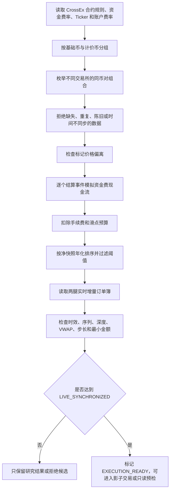

# CrossQuant 跨所资金费率套利策略与告警方案

## 1. 项目定位

本项目的核心策略是：**通过 Gate CrossEx 统一账户，在不同底层交易所的同一种永续合约上建立等量反向仓位，获取两边资金费率现金流之差。**

例如，同一时刻：

- Gate 的 BTC 永续资金费率较低；
- Binance 的 BTC 永续资金费率较高；
- 项目在 Gate 做多 BTC 永续，在 Binance 做空 BTC 永续；
- 两腿基础币数量尽量完全一致，使 BTC 涨跌造成的方向性盈亏互相抵消；
- 主要收益来自空腿收到的资金费，减去多腿支付的资金费、手续费、点差和滑点。

因此，这不是单纯押注币价上涨或下跌，也不是等待两个交易所价格价差收敛。它是一个**资金费率差套利策略**，但入场和平仓时仍会暴露于跨所基差、盘口滑点和两腿成交不同步风险。

> “市场中性”不等于“无风险”。只要两腿数量、成交时间、合约规则或标记价格不一致，仍然可能产生净敞口和亏损。

## 2. 收益计算逻辑

程序不会简单地用“当前每小时费率 × 24 小时”。它会按照两家交易所各自的：

- 当前资金费率；
- 下一次结算时间；
- 资金费结算周期；
- 设定的情景观察期；

分别计算观察期内实际可能发生多少次结算事件。

资金费现金流的基本方向为：

```text
多腿资金现金流 = -多腿费率 × 多腿结算次数
空腿资金现金流 =  空腿费率 × 空腿结算次数
资金费毛收益   = 多腿资金现金流 + 空腿资金现金流
```

正资金费率通常由多头支付给空头；负资金费率时方向会自然反转。程序比较观察期内的累计费率，选择累计资金成本更低的一边做多、累计资金收益更高的一边做空。

未使用实时盘口时，成本预算为：

```text
交易成本预算 = 双腿开仓和平仓手续费 + 四次成交的滑点预算
情景净收益   = 资金费毛收益 - 交易成本预算
快照情景年化 = 情景净收益 × 8760 ÷ 情景小时数
```

使用实时订单簿时，还会计算：

- 做多腿买入的多档 ask VWAP；
- 做空腿卖出的多档 bid VWAP；
- 按当前反向盘口立即平仓的估算 VWAP；
- 入场基差影响；
- 估算平仓基差影响；
- 按实际名义金额计算的手续费；
- 最终可执行快照净收益和快照年化。

这里的“快照情景年化”只用于候选排序，**不是未来预期 APR 或收益承诺**。当前资金费率可能在下一次结算前改变，平仓时的基差和盘口也不可能提前确定。

## 3. 候选生成流程



默认扫描阈值包括：

| 检查项 | 默认值 | 含义 |
|---|---:|---|
| 情景观察期 | 24 小时 | 假设当前费率不变时的现金流计算窗口 |
| 最低快照情景年化 | 10% | 低于该值的候选不输出 |
| 最大标记价偏离 | 0.3% | 两边 mark price 偏离过大时拒绝 |
| Ticker 最大年龄 | 10 秒 | 超时行情拒绝 |
| Ticker 最大跨所时间差 | 2 秒 | 两腿时间不同步时拒绝 |
| 单次成交滑点预算 | 2 bp | 开平仓共四次成交 |
| 默认目标名义金额 | 每腿 100 USDT | 用于深度和 VWAP 验证 |
| 订单簿最大年龄 | 3 秒 | Python 策略侧的盘口时效门槛 |
| 订单簿最大跨所时间差 | 1 秒 | Python 策略侧的两腿同步门槛 |

常驻行情服务使用更严格的默认认证标准：盘口年龄不超过 1.5 秒，两边交易所时间及本机接收时间差不超过 750 毫秒。

## 4. `LIVE_SYNCHRONIZED` 的含义

只有满足以下条件的两腿盘口才会获得 `LIVE_SYNCHRONIZED`：

1. 对应交易所 WebSocket 连接健康；
2. REST 快照初始化成功；
3. REST 快照与 WebSocket 增量完成序列桥接；
4. 增量序列没有断裂；
5. 发生断序后已经重新构建订单簿；
6. 买卖盘均存在，且没有交叉盘口；
7. 两边盘口没有过期；
8. 两边交易所时间戳足够接近；
9. 两边本机接收时间足够接近。

任何一项失败都会降级为 `BOOTSTRAPPING` 或 `LIVE_UNSYNCHRONIZED`，不会继续通过实盘预检。这是一个 fail-closed 设计：缺数据时拒绝交易，而不是假设数据仍然有效。

`EXECUTION_READY` 只表示候选通过了当前行情和深度检查，**不表示程序已经具备真实下单能力，也不表示交易必然盈利。**

## 5. 入场策略

建议只有同时满足以下条件时才允许进入影子交易，未来真实执行也应复用同一组硬门槛：

1. 资金费率候选的净快照年化超过设定阈值；
2. 两边是同一基础币、兼容计价币和可交易的永续合约；
3. 两腿盘口达到 `LIVE_SYNCHRONIZED`；
4. 目标金额下的多档 VWAP 仍有正净收益；
5. 两腿能按共同 lot size 生成完全匹配的基础币数量；
6. 两边均满足最小下单量和最小名义金额；
7. 标记价格偏离、盘口年龄和跨所时差均未超过阈值；
8. 账户、仓位、未结订单、保证金率和风险档位预检通过；
9. 没有全局熔断、行情降级或未修复的单腿敞口；
10. 候选连续存在一段确认时间，避免只响应一次瞬时尖峰。

当前项目已实现前 1–8 项的扫描或只读预检能力，并支持影子开仓；第 9–10 项需要在真实订单状态机和自动告警服务中完成闭环。

## 6. 持仓与平仓策略

资金费套利不应简单地“固定持有 24 小时”。建议未来状态机按事件进行管理：

### 正常持仓

- 持续刷新两边资金费率和下一次结算时间；
- 持续检查两腿基础币净敞口；
- 记录实际资金费入账、手续费和成交价；
- 持续计算“继续持有的预期收益”是否仍能覆盖平仓成本；
- 结算前提高监控频率，防止费率在最后阶段反转。

### 正常平仓条件

- 资金费率优势消失或方向反转；
- 继续持有的预计资金费收益低于平仓成本和安全边际；
- 已达到策略的目标收益或最长持仓时间；
- 跨所基差扩大到风险阈值；
- 保证金利用率、ADL 排名或账户风险接近限制。

### 紧急平仓或降仓条件

- 任一交易所私有订单/仓位流失联；
- 两腿真实仓位不再匹配；
- 一腿成交而另一腿失败，形成裸露敞口；
- 保证金不足、日亏损超限或全局熔断触发；
- 合约暂停交易、进入只减仓状态或规则发生变化；
- 行情长时间无法恢复同步，且无法安全评估仓位。

真实平仓必须使用最新盘口重新计算，而不能使用开仓时保存的“估算平仓价格”。

## 7. 当前告警能力

### 已实现

- 行情健康接口提供总体状态、四家连接状态、就绪盘口数量、重连次数和最后消息时间；
- 单个盘口接口提供同步状态、序号、重建次数、序列缺口数和错误原因；
- 两腿接口提供 `LIVE_SYNCHRONIZED` 质量和拒绝原因；
- 每 60 秒把配对质量、最佳买卖价、时间差和拒绝原因写入 SQLite，默认保留 30 天；
- 现有交易后端在触发全局风险熔断时会写审计事件和错误日志；
- 配置 `GCT_RISK_ALERT_WEBHOOK_URL` 后，全局熔断可以发送 HTTP Webhook。

### 尚未实现

- 资金费套利机会达到阈值时自动通知；
- 机会持续时间、消失或费率反转通知；
- `LIVE_SYNCHRONIZED` 降级和恢复通知；
- WebSocket 重连风暴、序列缺口和重复重建通知；
- 影子交易开仓、平仓、残余敞口和异常状态通知；
- 实际资金费到账偏差和策略 PnL 通知；
- Telegram、企业微信、飞书或邮件等具体通知渠道。

因此，目前可以查询和记录状态，也具备全局熔断 Webhook 基础设施，但还不能把它视为完整的 7×24 自动告警系统。

## 8. 建议的告警分级

| 级别 | 场景 | 建议动作 |
|---|---|---|
| INFO | 新候选连续满足条件；影子开平仓成功；行情恢复 | 发送普通通知并记录事件 |
| WARNING | 单所重连；短时行情降级；候选收益快速下降；临近结算费率变化 | 通知，暂停该交易对新开仓 |
| CRITICAL | 序列持续断裂；两腿净敞口；保证金不足；私有流失联；日亏损超限 | 立即熔断新单，撤销挂单并触发修复流程 |
| EMERGENCY | 无法修复的裸露仓位；交易所返回未知订单状态；账户对账不一致 | 高频通知，要求人工接管，并按预案降仓 |

建议的核心告警规则：

| 告警 | 推荐触发条件 | 恢复条件 |
|---|---|---|
| 行情服务异常 | 总体状态连续 15 秒不是 `healthy` | 连续 30 秒恢复 healthy |
| 单所连接异常 | 连接进入 stale/disconnected，或 5 分钟重连 ≥ 3 次 | 连接稳定 5 分钟 |
| 订单簿断序 | `sequenceGaps` 增加 | 重建完成且连续稳定 60 秒 |
| 订单簿重建风暴 | 同一盘口 10 分钟重建 ≥ 3 次 | 30 分钟无新增重建 |
| 机会出现 | `EXECUTION_READY` 且净年化超过阈值，并连续成立 30–60 秒 | 不适用 |
| 机会消失 | 已通知候选低于退出阈值或不再同步 | 不适用 |
| 费率反转 | 多腿/空腿最优方向发生反转 | 人工确认或自动平仓完成 |
| 影子敞口 | `net_base_exposure` 不为零且超过宽限期 | 敞口归零 |
| 保证金风险 | 初始/维持保证金率低于策略门槛 | 回到安全区并保持一段时间 |
| 服务离线 | 健康接口连续 3 次不可达 | 连续 3 次可达 |

为避免告警风暴，应按 `告警类型 + 交易所 + 币种 + 多空组合` 生成去重键，并实现：

- 首次触发立即通知；
- 未恢复时按 15、30、60 分钟逐步提醒；
- 状态恢复时单独发送恢复通知；
- 阈值附近使用进入/退出两个不同阈值，避免反复抖动；
- 每条消息携带首次发生时间、持续时间、当前值、阈值、最近错误及建议动作。

## 9. 推荐告警消息格式

```json
{
  "event": "funding_opportunity_ready",
  "severity": "INFO",
  "asset": "BTC",
  "long_symbol": "GATE_FUTURE_BTC_USDT",
  "short_symbol": "BINANCE_FUTURE_BTC_USDT",
  "market_data_quality": "LIVE_SYNCHRONIZED",
  "target_notional_per_leg": "100",
  "executable_snapshot_annualized": "0.1825",
  "next_long_funding_at": "...",
  "next_short_funding_at": "...",
  "book_time_skew_ms": 120,
  "first_seen_at": "...",
  "confirmed_at": "...",
  "dedup_key": "funding_opportunity_ready:BTC:GATE:BINANCE"
}
```

告警中应明确使用“快照情景年化”，不能写成“预计年化收益”或“保证 APR”。

## 10. 推荐运行方式

人工扫描同步盘口候选：

```powershell
crossex-arb scan --assets BTC,ETH --live-order-book --target-notional 100 --json
```

生成只读账户预检和 FOK 订单草案：

```powershell
crossex-arb scan --assets BTC,ETH --live-order-book --target-notional 100 --preflight --json
```

写入影子交易账本：

```powershell
crossex-arb scan --assets BTC,ETH --live-order-book --target-notional 100 \
  --shadow-db data/shadow.db --shadow-key funding-btc-001
```

查看影子仓位：

```powershell
crossex-arb shadow-list --db data/shadow.db
```

线上行情健康检查：

```text
GET https://crossquant.shadowdawn.xyz/api/execution-market/health
```

建议下一阶段增加一个常驻 `funding-monitor` 进程：固定周期扫描候选，维护候选状态机和告警去重状态，读取行情服务及影子账本，并统一把通知发送到 Webhook。Webhook 再转发到 Telegram、飞书、企业微信或其他渠道。告警发送失败不能阻塞行情采集、撤单或风险处置。

## 11. 当前边界和上线结论

当前版本已经具备：

- 资金费率候选发现；
- 不同结算时间的现金流模拟；
- 手续费和滑点预算；
- 四所持续增量盘口；
- 严格同步质量认证；
- 目标金额下的多档 VWAP 验证；
- 影子交易账本；
- 账户只读预检；
- 行情质量历史保存；
- 全局熔断 Webhook 基础能力。

当前版本仍然**不会发送真实订单**。距离自动实盘主要还差：

1. 常驻资金费候选与告警服务；
2. 私有订单、成交、仓位事件闭环；
3. 两腿真实订单状态机；
4. 部分成交和单腿失败的自动修复；
5. 重启后的订单与仓位对账；
6. 实际资金费、手续费、滑点和 PnL 归因；
7. 小额 canary、分级放量和人工启用流程。

在以上模块完成并经过足够长的影子观察前，项目应保持只读和影子模式，不能因为出现 `EXECUTION_READY` 就直接自动下单。
